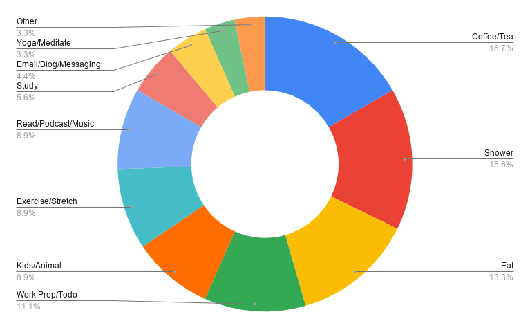
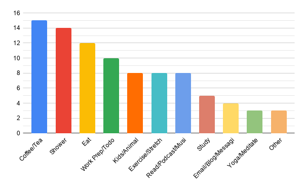

So when trying to figure this week's post topic, I went back to last week's post and had an epiphany. Lately I've been getting more into Data Science and Machine Learning..... so why not take the comments about everyone's morning routine and extract some data! Well... there was only 22 people who responded but, hey! It's still data! Not a big enough sample size to make any real conjectures, but still was fun to look at the data.

## Data! 
- Kids/Animals (Care): This category was for anyone who cared for a pet or child. There weren't many responses dealing with children, so I decided to lump this as a "care for".
- Coffee/Tea: Anyone who needed to start off the day with some coffee or tea
- Exercise/Stretching: Exercising and stretching was commonly together, so also lumped these two together
- Yoga/Meditate: Same as above but less hardcore
- Study: Bit of studying in the morning is always good!
- Shower: Gotta get clean. I was surprised to see 3 respondents saying they took cold showers!
- Read/Podcast/Music: Anyone who did any reading/listening at home/on commute
- Work Prep/Todo: Prepping today's todo was pretty common!
- Eat: Most important meal of the day
- Emails/Blogs/Messaging: Anyone checking their emails, blogs, messaging, and/or social media
- Other: This includes anything that I couldn't find a good classification for

With a total number of 22 respondents, here's the data!

## Summary

Overall it's interesting! Of course there is not enough data to make any conclusions. If anything it's interesting to see what people wrote. Coffee/Tea and Showering seem to have come out on top! I wonder if there is any bias? Maybe reading another person's comment effects how one responds?

I would love to do more surveys/data collection in the future! Still a beginner in the world of data science.

If you have any advice, please let me know down below!

*Leave a comment over at [dev.to](https://dev.to/tylerwel/morning-routine-analysis-omf)!*
